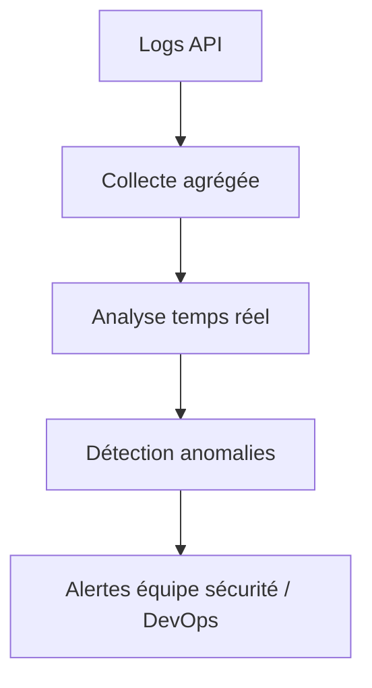
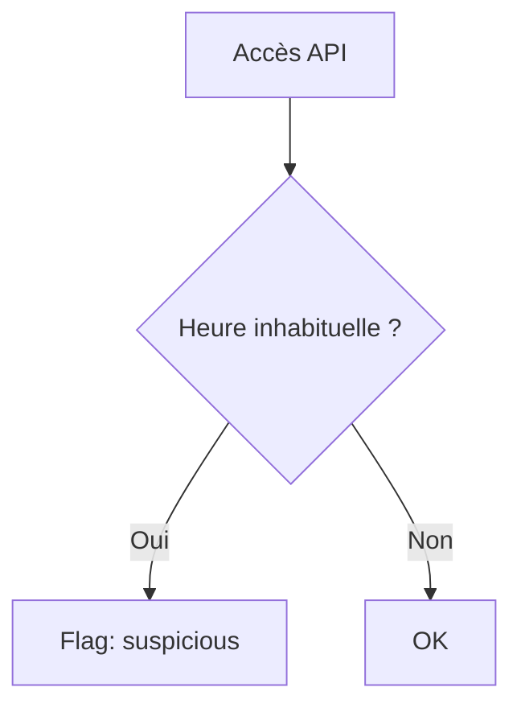

# **11.1 — Alerting (API abuse, brute force, accès inhabituels)**

L’alerting est la capacité d’une API à **détecter automatiquement des comportements anormaux** et à **notifier une équipe** avant qu’un incident ne devienne critique.

Une API bien sécurisée **observe en permanence** :

* qui l’utilise,
* comment elle est utilisée,
* à quelle fréquence,
* avec quel type d’accès,
* depuis quelles zones géographiques.

L’objectif du chapitre :
Apprendre *simplement* comment identifier les attaques typiques grâce à un système d’alerting efficace.

---

# **11.1.1 — Pourquoi l’alerting est indispensable ?**

Sans alerting, une API peut subir :

* bruteforce d’identifiants
* attaques BOLA
* scraping massif
* vol de tokens
* tentatives d’injection
* déni de service
* exploration abusive de l’API

… **sans que personne ne s’en rende compte.**

L’alerting permet :

* une réponse rapide,
* une réduction drastique des dégâts,
* une compréhension des comportements suspects,
* un suivi en temps réel de la sécurité.

---

# **11.1.2 — Types d’événements à surveiller**

Les événements critiques à monitorer sont :

### ✔ Authentification

* tentatives échouées
* bruteforce
* connexions depuis nouveaux devices
* connexions simultanées suspectes

### ✔ Autorisation

* erreurs 403 répétées
* accès refusés sur des ressources sensibles
* variations d’ID (pattern BOLA)

### ✔ Débit et volume

* trop de requêtes
* dépassement de quotas
* absence de rate-limit activée

### ✔ Cohérence des tokens

* token utilisé depuis 2 pays simultanément
* token utilisé sur des plages horaires incohérentes
* token expiré utilisé en boucle

### ✔ Accès inhabituels

* IP étrangères non attendues
* user-agents inconnus
* accès en dehors des heures normales

---

# **11.1.3 — Schéma : rôle de l’alerting dans le système API**



---

# **11.1.4 — Alertes liées aux attaques de bruteforce**

### Symptômes :

* augmentation subite de `401 Unauthorized`
* même IP ou même user-agent
* tentatives sur plusieurs comptes
* cadence élevée (1–100 tentatives/s)

### Règle d’alerte typique :

```
> 10 échecs login / minute / IP → WARNING
> 50 échecs login / minute / IP → ALERT
```

### But :

Empêcher l’attaquant d’essayer des milliers de mots de passe.

---

# **11.1.5 — Alertes liées aux attaques BOLA (Broken Object Level Authorization)**

La faille API n°1.

### Symptômes :

* un utilisateur appelle :
  `/orders/1, /orders/2, /orders/3, ...`
* erreurs 403 ou 404 en rafale
* exploration séquentielle d’IDs

### Exemple de pattern détecté :

```text
GET /users/12 → 200
GET /users/13 → 403
GET /users/14 → 403
GET /users/15 → 403
```

### Règle d’alerte typique :

```
Plus de 3 IDs différents testés en < 1 minute → alerte BOLA
```

---

# **11.1.6 — Alertes de scraping ou d’abus de l’API**

Le scraping consiste à récupérer massivement des données.

### Symptômes :

* appels très rapides et réguliers
* absence de navigation cohérente
* user-agent d’automatisation (curl, python, bot…)
* endpoints publics appelés en boucle

### Exemple de règle :

```
> 100 requêtes / minute / IP sur le même endpoint → suspect
> 1000 requêtes / minute / IP → alerte rouge
```

---

# **11.1.7 — Alertes de tokens suspects**

Exemples :

### ✔ Token utilisé depuis deux pays différents

```
Belgique → 10h15
Brésil → 10h17
```

→ Impossible : token probablement volé.

### ✔ Token utilisé trop fréquemment

→ bot ou automatisation abusive

### ✔ Token expiré utilisé en boucle

→ tentative d'abus ou erreur grave côté client

---

# **11.1.8 — Alertes d’injection (SQL, NoSQL, XSS)**

Les injections laissent souvent des traces dans les logs :

* caractères suspects (`'`, `"`, `%00`, `<script>`)
* erreurs serveur 500
* messages SQL dans les logs

### Exemple de règle :

```
Détection de patterns injection sur 3 requêtes consécutives → alerte
```

---

# **11.1.9 — Alertes de dépassement ou absence de rate-limiting**

Une API sans rate-limit est **visiblement attaquable**, car :

* l’attaque peut être massive,
* la charge augmente,
* jusqu’au déni de service complet.

### Alerte typique :

```
augmentation brutale du débit → possible DDoS
```

Si l’API ne retourne **jamais** de 429 →
cela signifie que le rate-limit **n’est pas activé** → alerte de configuration.

---

# **11.1.10 — Alertes d’accès inhabituels**

### Indicateurs :

* connexion à 4h du matin depuis un pays inattendu
* utilisateur inactif depuis 6 mois réactivé soudainement
* accès admin inhabituel
* API appelée avec un vieux token

### Exemple de logique simple :



Même logique pour pays, device, IP, user-agent…

---

# **11.1.11 — Systèmes d’alerting courants**

### ✔ Outils de monitoring

* Datadog
* Prometheus + Alertmanager
* Grafana Loki
* AWS CloudWatch
* Google Cloud Operations

### ✔ Systèmes SIEM

* Splunk
* Elastic Security (ex-ELK)
* Wazuh

### ✔ Outils de sécurité API

* Wallarm
* Salt Security
* Akamai API Security

---

# **11.1.12 — Format d’une alerte efficace**

Une alerte doit contenir :

* description simple
* niveau de gravité
* événement déclencheur
* IP / user-agent (selon RGPD)
* trace d’appel
* horodatage
* recommandations d’action rapide

Exemple :

```
ALERTE CRITIQUE — SUSPICIOUS TOKEN USAGE
Token utilisé depuis deux pays différents en moins de 5 minutes.
Action recommandée : Révoquer le token et vérifier les logs associés.
```

---

# **11.1.13 — Eviter les faux positifs**

Un système d’alerting mal calibré peut devenir inutile :

* trop d’alertes
* alertes non pertinentes
* alert fatigue → personne ne lit plus rien

Bonne pratique :

* définir des seuils réalistes
* corréler plusieurs signaux avant d’alerter
* différencier “warning” et “critical”

---

# **11.1.14 — Résumé du sous-chapitre**

L’alerting API permet de détecter :

* brute force
* BOLA et explorations d’ID
* scraping abusif
* bots
* tokens volés
* injections
* attaques DDoS
* comportements inhabituels

Un bon système d’alerting doit :

* être simple
* être fiable
* éviter les faux positifs
* notifier les bonnes personnes
* permettre une réponse rapide
