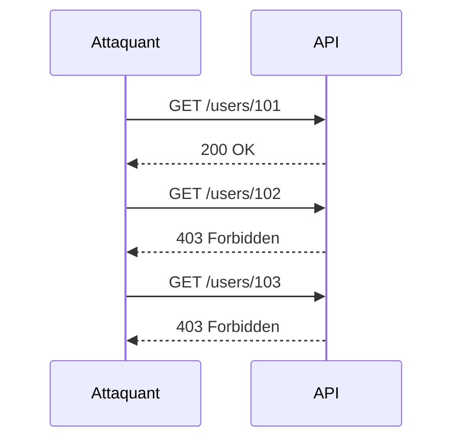
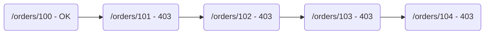
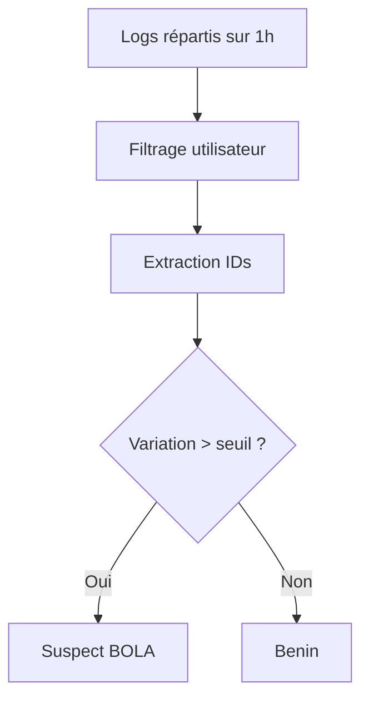

# **11.2 — Détection BOLA via logs**

La vulnérabilité **BOLA — Broken Object Level Authorization** (OWASP API1) est **la faille la plus fréquente dans les APIs**.
Elle consiste à accéder à des ressources qui ne nous appartiennent pas, simplement en modifiant un identifiant :

```
GET /users/123
→ Et si je tente /users/124 ?
```

La détection de BOLA via les logs est **cruciale**, car :

* la majorité des attaques BOLA sont silencieuses,
* les scanners automatiques (DAST) ne savent pas les détecter complètement,
* les logs sont souvent la seule source permettant d’identifier la tentative.

Ce chapitre explique comment détecter BOLA **uniquement grâce aux logs**, à l’aide de schémas, d’exemples, et de patterns simples à analyser.

---

# **11.2.1 — Rappel : qu’est-ce qu’une tentative de BOLA ?**

Un utilisateur teste :

* différents IDs,
* appartenant à d’autres utilisateurs,
* pour voir ce que l’API renvoie.

Exemple :

```
GET /orders/1   → 200 (son order)
GET /orders/2   → 403 (pas à lui)
GET /orders/3   → 403
GET /orders/4   → 403
```

Ce pattern dans les logs est **une signature extrêmement forte d'une attaque BOLA**.

---

# **11.2.2 — Quelles données de logs permettent la détection ?**

Les logs doivent contenir :

### ✔ Identifiant de l’utilisateur (sub, userId, email, etc.)

Pour savoir *qui* réalise les requêtes.

### ✔ Le paramètre manipulé

L’ID ou l’identifiant de ressource.

### ✔ Le code HTTP

* 200, 403, 404 → suffisent pour détecter un pattern BOLA
* 500 → peut aussi révéler une autorisation incorrecte

### ✔ Timestamp

Pour analyser le rythme des tentatives.

### ✔ IP / user-agent

Pour identifier comportements automatisés (bots).

---

# **11.2.3 — Schéma simple d’une tentative de BOLA**



Ce schéma représente le pattern typique :
**1 réponse valide → cascade de refus = exploration d’IDs.**

---

# **11.2.4 — Signaux faibles révélant une BOLA**

Même si la tentative est subtile, certains signaux apparaissent dans les logs :

### ✔ Variation d’IDs dans un court laps de temps

Exemple :

```
/users/15
/users/16
/users/17
/users/18
```

### ✔ Même utilisateur pour plusieurs ressources différentes

→ possible exploration de l’API.

### ✔ Succession rapide de 403

→ l’attaquant teste les limites.

### ✔ Succession rapide de 404

→ exploration de ressources inexistantes.

### ✔ Changement d’ID sans cohérence métier

Exemple :
Un même utilisateur teste 20 commandes différentes en 5 secondes.

---

# **11.2.5 — Pattern BOLA dans les logs (exemple brut)**

```
2024-02-11T10:05:01 user=alice GET /orders/100 200
2024-02-11T10:05:03 user=alice GET /orders/101 403
2024-02-11T10:05:04 user=alice GET /orders/102 403
2024-02-11T10:05:04 user=alice GET /orders/103 403
2024-02-11T10:05:05 user=alice GET /orders/104 403
```

→ Pattern **très clair** : tentative de lire des commandes qui ne lui appartiennent pas.

---

# **11.2.6 — Visualisation d’un BOLA dans un graphe**



Un graphe séquentiel met visuellement en évidence :

* l’accès légitime initial,
* l’exploration qui suit.

---

# **11.2.7 — Faux positifs possibles**

Attention à ne pas déclencher des alertes injustifiées.

### Faux positif 1 : test interne / QA

Un testeur peut explorer plusieurs IDs.

### Faux positif 2 : microservice mal configuré

Un service interne peut appeler des IDs dans une boucle.

### Faux positif 3 : automatisation interne

Exemple : un script de monitoring erroné.

### Solution :

Corréler les logs avec :

* le rôle utilisateur,
* le pattern d’utilisation classique,
* l’adresse IP source,
* l’environnement (prod vs staging).

---

# **11.2.8 — Règles d’alerting pour BOLA**

Voici des règles simples, efficaces, orientées production :

### ✔ Règle n°1 : séquence de 403 / 404

```
> 3 tentatives d’accès à des IDs différents en < 30 secondes → alerte BOLA
```

### ✔ Règle n°2 : pattern d’incrémentation

```
ID(n+1), ID(n+2), ID(n+3) → forte probabilité d'exploration
```

### ✔ Règle n°3 : utilisateur faible ou non admin qui explore des IDs admin

Cf. "vertical BOLA".

### ✔ Règle n°4 : endpoint sensible exploré

Exemples critiques :

* /users/{id}
* /payments/{id}
* /invoices/{id}
* /password-reset/{token}

---

# **11.2.9 — Détection avancée : corrélation des logs**

## Cas d’usage :

Un attaquant explore un ID de ressource toutes les 5 minutes (slow probing).

Très difficile à repérer avec de simples règles.

Solution :
Corrélation sur 1 heure :

* IDs différents
* codes 404/403 majoritaires
* utilisateur toujours le même



---

# **11.2.10 — Exemples d’alertes générées**

### **Alerte 1 : Exploration rapide**

```
ALERTE BOLA — Exploration d’IDs détectée
User: alice
Endpoints: /orders/{101..104}
Rythme: 4 requêtes en 2 secondes
Action recommandée: vérifier l’intention utilisateur
```

---

### **Alerte 2 : Exploration lente**

```
ALERTE BOLA — Pattern d'accès anormal sur 30 minutes
User: bob
IDs testés: 32, 33, 36, 41, 43
Action recommandée: bloquer l’utilisateur et analyser les logs
```

---

# **11.2.11 — Comment améliorer la détection BOLA ?**

### ✔ Toujours loguer l’identifiant utilisateur

→ obligatoire pour reconstruire la logique métier.

### ✔ Loguer l’ID de ressource demandé

Sans l’ID exact, impossible d'analyser.

### ✔ Conserver l’historique

Minimum recommandé : 30 jours.

### ✔ Définir un rôle clair interne / externe

Un microservice peut aussi générer de faux positifs.

### ✔ Détection basée sur machine learning

Approche plus avancée :

* identifier les patterns usuels,
* détecter les écarts anormaux.

---

# **11.2.12 — Résumé du sous-chapitre**

La détection BOLA est essentielle car :

* c’est la vulnérabilité API n°1,
* elle est souvent invisible sans logs,
* les scanners automatiques la détectent mal.

Pour la détecter efficacement :

* analyser les variations d’IDs,
* détecter les séquences rapides de 403/404,
* corréler les accès sur la durée,
* surveiller les endpoints sensibles,
* déclencher des alertes en cas de patterns suspects.

Une bonne détection BOLA repose sur :
**des logs complets, une analyse cohérente, et des règles d’alerting robustes.**