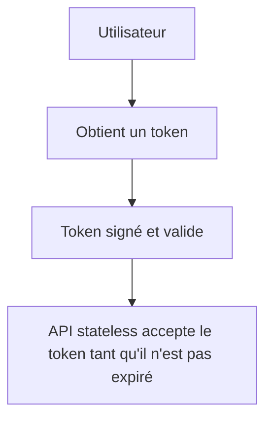
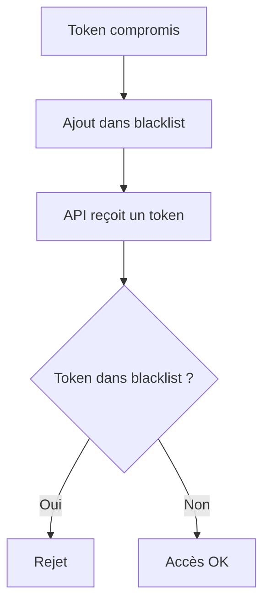
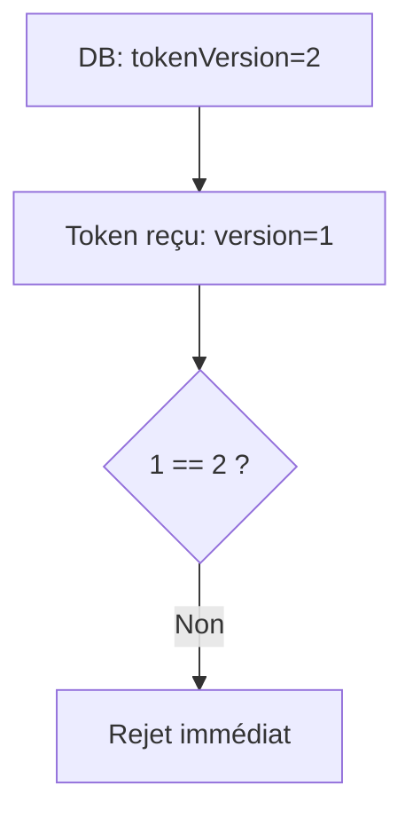
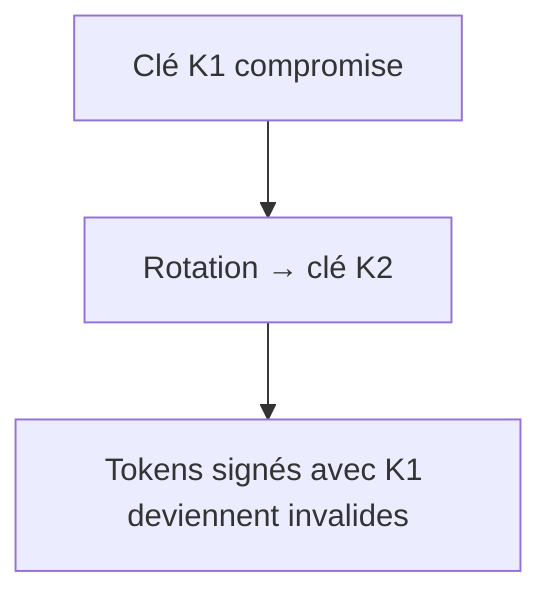

# **11.3 — Revocation de tokens**

La **révocation de tokens** est un mécanisme essentiel pour contrôler l’accès à une API.
Elle permet d’invalider un token **avant son expiration naturelle**, par exemple lorsque :

* un token a été volé,
* un utilisateur se déconnecte,
* un compte est compromis,
* un droit change (promotion, rétrogradation),
* une session doit être immédiatement terminée,
* un employé quitte l’entreprise.

Sans mécanisme de révocation, un token compromis reste **valide jusqu’à son expiration** — ce qui peut durer minutes, heures, jours ou même des mois selon le système.

Ce chapitre explique :

* pourquoi la révocation est indispensable,
* comment elle fonctionne,
* les stratégies courantes,
* leurs avantages / inconvénients,
* comment détecter l’utilisation d’un token révoqué,
* et comment intégrer la révocation dans une API stateless.

---

# **11.3.1 — Pourquoi révoquer un token ?**

Un token donne accès à l’API comme une **clé** donne accès à une maison.

Si la clé est perdue ou volée → on change la serrure.

Même logique pour les APIs.

### Cas qui nécessitent une révocation immédiate :

1. Token volé (phishing, malware, fuite de logs…)
2. Session d’un utilisateur compromise
3. Employé quittant l’entreprise
4. Détection d’accès depuis deux pays différents
5. Promotion d’un utilisateur → permissions changent
6. Blocage ou suppression d’un compte
7. Déconnexion volontaire (logout)

Sans révocation → **l’accès continue**, et l’attaquant aussi.

---

# **11.3.2 — Problème fondamental des APIs stateless**

Les APIs modernes sont **stateless** :

* elles ne stockent pas l’état des sessions
* elles ne gardent pas en mémoire les tokens
* elles se contentent de vérifier la signature cryptographique

Cela veut dire :

> Tant que le token est signé correctement et pas expiré…
> L’API le considère valide.

**Donc une API stateless n’a PAS nativement un mécanisme de révocation.**

Il faut **rajouter** un mécanisme externe.

---

# **11.3.3 — Schéma du problème**



Même si le token est volé → l’API l’accepte.
C’est pourquoi la révocation est indispensable.

---

# **11.3.4 — Stratégies de révocation de tokens**

Il existe 4 grandes stratégies :

---

## **1) Blacklist (liste noire)**

On stocke les tokens à ne pas accepter.

### Principe :

* Ajouter le token compromis dans une base (Redis, DB)
* L’API vérifie à chaque requête si le token est dans la blacklist

### Avantages :

* très simple à comprendre
* efficace immédiatement
* invalide un seul token sans impact sur les autres

### Inconvénients :

* nécessite stockage centralisé
* augmente la latence
* la liste peut grandir énormément
* contredit le principe stateless

---

## **2) Token versionné (Token Versioning)**

Chaque utilisateur possède un champ « tokenVersion ».

### Principe :

* Le token contient `tokenVersion=x`
* Si le serveur change ce numéro (ex : x+1),
  tous les tokens précédents deviennent invalides

### Avantages :

* invalide d’un coup tous les tokens d’un utilisateur
* aucune liste noire
* idéal pour réinitialisation de mot de passe

### Inconvénients :

* invalide *tous* les tokens (pas seulement le compromis)

---

## **3) Rotation + Refresh tokens courts**

C’est le système utilisé par Google, Microsoft, Auth0…

### Principe :

* Access tokens courts (5–15 minutes)
* Refresh token utilisé pour renouveler l’accès
* Si compromis → on révoque le refresh token

### Avantages :

* réduction drastique de la fenêtre d’attaque
* access token volé = impact limité

### Inconvénients :

* plus complexe à implémenter
* nécessite un stockage pour les refresh tokens

---

## **4) Revocation via JWK rotation (clés cryptographiques)**

On change la clé de signature (rotation des clés), ce qui invalide :

* tous les tokens signés avec l’ancienne clé
* sauf ceux re-signés avec la nouvelle clé

### Avantages :

* valable quand on soupçonne une fuite de clé privée
* mécanisme global et robuste

### Inconvénients :

* invalide tous les tokens du système
* induit un redémarrage massif de sessions

---

# **11.3.5 — Comparaison des méthodes**

| Méthode            | Granularité         | Impact    | Complexité | Usage recommandé   |
| ------------------ | ------------------- | --------- | ---------- | ------------------ |
| Blacklist          | Token individuel    | Faible    | Simple     | Petits systèmes    |
| Token versionné    | Utilisateur         | Moyen     | Moyen      | Reset mot de passe |
| Rotation + Refresh | Token ± utilisateur | Faible    | Haute      | APIs modernes      |
| Rotation de clés   | Tous tokens         | Très fort | Moyen      | Clé compromise     |

---

# **11.3.6 — Détection d’un token révoqué**

Une API doit être capable de détecter :

### ✔ Token utilisé **après révocation**

→ tentative d’attaque probable

### ✔ Token utilisé depuis une autre IP / pays

→ alerte de compromission

### ✔ Token expiré mais réutilisé en boucle

→ bot ou tentative bruteforce des refresh tokens

---

# **11.3.7 — Patterns de logs indiquant qu’un token révoqué est utilisé**

Log typique :

```
2024-02-11 10:22:33 WARN Token revoked rejected
sub=alice
tokenVersion=1 (expected 2)
```

Autre exemple :

```
Repeated requests with a refresh token after revocation
```

Autre :

```
Token signature mismatch after key rotation
```

Ces patterns doivent déclencher des alertes automatiques.

---

# **11.3.8 — Schéma de la révocation par blacklist**



---

# **11.3.9 — Schéma de la révocation via tokenVersion**



---

# **11.3.10 — Schéma de rotation clé (JWK rotation)**



---

# **11.3.11 — Quelle stratégie enseigner à des néophytes ?**

La meilleure pour apprendre :

### ✔ Access tokens courts

### ✔ Refresh tokens + stockage sécurisé

### ✔ Liste noire de refresh tokens compromis

### ✔ TokenVersion pour les resets critiques

C’est la combinaison utilisée par :

* Google
* Auth0
* Firebase Auth
* AWS Cognito

---

# **11.3.12 — Résumé du sous-chapitre**

La révocation de tokens est essentielle car :

* elle réduit la fenêtre d’attaque,
* elle annule les tokens compromis,
* elle permet de couper l’accès immédiatement,
* elle protège contre le vol de tokens,
* elle gère les changements d’état utilisateur.

Méthodes les plus importantes :

1. Blacklist
2. Token versionné
3. Rotation (access/refresh tokens)
4. Rotation de clés (JWK)

Une API stateless **n’a pas de révocation native**, elle doit en implémenter une.