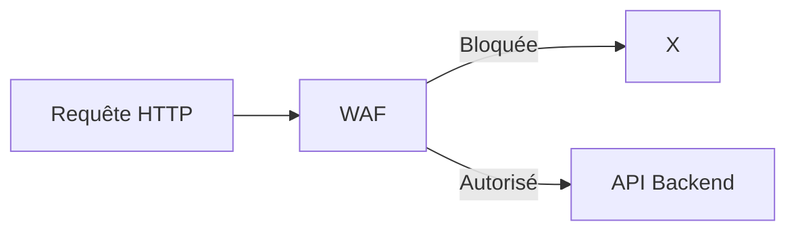
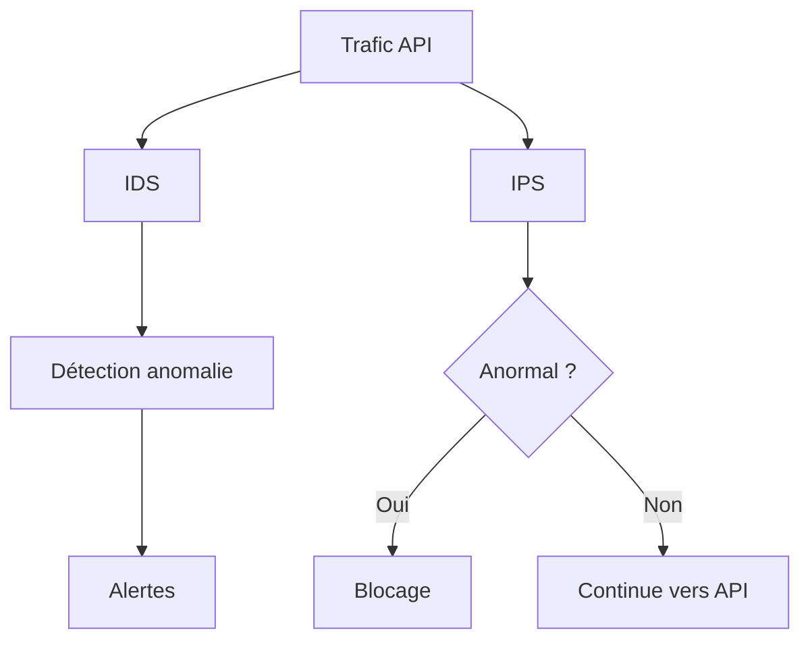
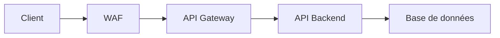

# **11.4 — Protection en temps réel (WAF, IDS, API Gateway)**

Les protections en temps réel sont des systèmes qui **surveillent, filtrent et bloquent** les requêtes malveillantes **avant** qu’elles n’atteignent votre API ou pendant leur exécution.
Elles complètent :

* la sécurité applicative (dans votre code),
* la détection via logs,
* la CI/CD sécurisée.

Elles agissent comme une **couche défensive supplémentaire**, indispensable pour toute API exposée à Internet.

Dans ce chapitre, nous allons voir :

* ce qu’est un WAF
* ce qu’est un IDS/IPS
* le rôle des API Gateways
* comment ces outils bloquent les attaques en temps réel
* leurs limites
* des schémas visuels pour bien comprendre

---

# **11.4.1 — Pourquoi une protection en temps réel est nécessaire ?**

Même avec :

* une bonne validation d’entrée,
* des tokens sécurisés,
* un code propre,
* une CI/CD sans failles,
* une surveillance continue…

… il reste des risques :

* nouvelles attaques (0-day)
* scanners automatiques agressifs
* bots explorant vos endpoints
* attaques DDoS / bruteforce
* erreurs humaines dans le code
* failles dans les dépendances

Une couche de protection en temps réel **absorbe les attaques** avant qu’elles atteignent votre application.

---

# **11.4.2 — WAF (Web Application Firewall)**

Un **WAF** analyse le trafic HTTP pour bloquer :

* injections SQL
* XSS
* attaques sur fichiers
* patterns OWASP
* bots et scanners
* comportements anormaux
* attaques connues (signatures pré-définies)

Le WAF fonctionne en examinant **chaque requête** et en la comparant :

1. à des signatures d’attaque connues,
2. à des règles comportementales (heuristiques),
3. à des modèles ML (plus avancé).

### Schéma simple



---

# **11.4.3 — Que peut bloquer un WAF ?**

### ✔ Tentatives d’injection

```
' OR 1=1 --
<script>alert(1)</script>
../../../../etc/passwd
```

### ✔ Robots d’attaque

* reconnaissance automatique
* scanners (Nikto, Gobuster…)
* scripts massifs

### ✔ DDoS applicatif (limité)

→ trop de requêtes simultanées

### ✔ Violations de règles CORS

→ peut bloquer des origines non autorisées

### ✔ Anomalies HTTP

→ requêtes malformées, header suspects

---

# **11.4.4 — IDS / IPS : surveillance et blocage**

### **IDS** (Intrusion Detection System)

→ Détecte les attaques
→ N’intervient pas directement
→ Génère des alertes

### **IPS** (Intrusion Prevention System)

→ Détecte
→ **Bloque** automatiquement

Les deux peuvent être couplés avec des logs API pour enrichir la détection.

---

# **11.4.5 — Schéma IDS / IPS**



---

# **11.4.6 — API Gateway : le bouclier des microservices**

Une API Gateway agit comme :

* un point d'entrée unique
* un répartiteur
* un contrôleur d’accès
* un analayseur de trafic
* un proxy intelligent

Elle peut implémenter :

### ✔ Rate limiting (limitation de débit)

### ✔ Quotas par utilisateur

### ✔ Authentification centralisée (JWT, OIDC)

### ✔ Signature des requêtes

### ✔ Validation schéma JSON

### ✔ Transformation de requêtes

### ✔ Protection DDoS

### ✔ Caching

### ✔ Audit et logging centralisé

Exemples de Gateways :

* Kong
* Apigee
* AWS API Gateway
* NGINX / Traefik
* Ambassador / Istio (service mesh)

---

# **11.4.7 — Pourquoi une API Gateway améliore la sécurité ?**

Parce qu’elle centralise :

* l’accès,
* l’authentification,
* le contrôle du débit,
* la validation des requêtes,
* la détection des anomalies.

C’est une **couche obligatoire** pour les architectures modernes.

---

# **11.4.8 — Schéma global d’une architecture protégée**



Cette architecture superpose **plusieurs défenses** :

* WAF (bloque les attaques connues)
* API Gateway (régule et contrôle l’accès)
* Backend (validation business + autorisation)

---

# **11.4.9 — Exemples d’attaques bloquées en temps réel**

### 🛑 Injection SQL

→ WAF bloque car payload dangereux

### 🛑 Bruteforce

→ Gateway active rate limit → renvoie 429

### 🛑 Exploration d’API

→ WAF détecte pattern suspect → bannit IP

### 🛑 Token volé

→ Gateway détecte incohérence géographique → bloque

### 🛑 DDoS

→ API Gateway filtre + cloud provider absorbe le trafic

---

# **11.4.10 — Limites du WAF et de l’API Gateway**

### ❌ WAF n’est pas infaillible

Un attaquant peut contourner certaines règles.

### ❌ Ne comprend pas la logique métier

Exemple :
→ Il ne sait pas si Alice peut voir la commande #42
→ Donc ne peut pas détecter une BOLA

### ❌ Risque de faux positifs

Certaines requêtes légitimes peuvent être bloquées.

### ❌ Nécessite une maintenance continue

* mise à jour des règles
* tuning du rate limiting
* mise à jour des signatures

---

# **11.4.11 — Les protections ML / comportementales modernes**

Des solutions avancées (Salt Security, Akamai API Security, Wallarm) appliquent :

* machine learning
* détection comportementale
* analyse de séquence
* détection d’anomalies statistiques
* analyse profonde des flux JSON

→ Essential pour détecter les attaques API complexes.

---

# **11.4.12 — Résumé du sous-chapitre**

Protection en temps réel = **WAF + API Gateway + IDS/IPS**.

Leurs rôles :

* bloquer les attaques connues
* limiter le débit
* bloquer les bots
* identifier les comportements anormaux
* protéger les endpoints sensibles
* réduire la charge sur le backend

Mais ils **ne remplacent pas** :

* la validation d’entrée
* l’autorisation
* le Zero Trust
* les protections métier contre BOLA

Ils ajoutent une couche essentielle :
**la défense active en temps réel.**