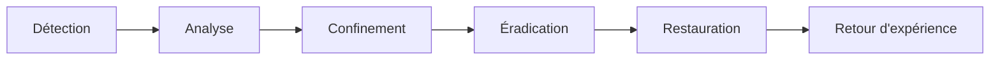
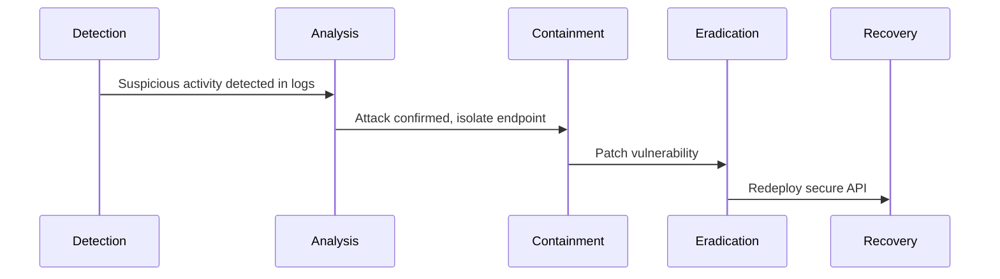

# **11.5 — Plan de réponse à incident**

Un **incident de sécurité API** n’est jamais une simple anomalie technique.
C’est un événement qui peut toucher :

* la confidentialité (données exposées),
* l’intégrité (données modifiées ou supprimées),
* la disponibilité (API indisponible ou dégradée),
* la réputation et la conformité légale.

Un **plan de réponse à incident** permet de réagir de manière structurée, rapide et coordonnée lorsqu’une attaque est détectée.

Dans ce chapitre, nous allons voir :

* pourquoi un plan est indispensable,
* les étapes d’un incident (du signal à la résolution),
* quels outils et informations utiliser,
* comment structurer la communication,
* comment éviter que l’incident ne se reproduise.

---

# **11.5.1 — Pourquoi un plan de réponse à incident est indispensable ?**

Parce qu’en situation d’urgence, sans plan :

* chacun improvise,
* les décisions sont confuses,
* les mauvais choix aggravent la situation,
* les preuves sont perdues,
* la communication devient chaotique.

Avec un plan défini à l’avance :

* la réponse est rapide,
* les rôles sont clairs,
* la prise de décision est structurée,
* les dégâts sont limités,
* les obligations légales sont respectées.

---

# **11.5.2 — Les 6 étapes d’un incident de sécurité**

Voici le modèle standard utilisé par :

* NIST,
* ISO 27035,
* ANSSI.

Nous allons l’adapter aux APIs :

---

# **11.5.3 — Étape 1 : Détection**

La détection peut venir de :

### ✔ Alerting automatique

(rate limit, BOLA, bruteforce, injection…)

### ✔ Logs analysés

(accès suspects, comportements anormaux)

### ✔ Outils de sécurité

(WAF, IDS, API Security platforms)

### ✔ Retour d’un utilisateur

(“Je vois les données d’un autre utilisateur”)

### ✔ Signaux faibles

(lenteur, charge, erreurs inattendues)

Objectif :
**identifier qu’un incident pourrait être en cours**.

---

# **11.5.4 — Étape 2 : Analyse**

On cherche à comprendre :

* la nature de l’incident
* la portée des dégâts
* les utilisateurs affectés
* le niveau de sévérité
* si l’attaque est encore active
* quelles ressources sont touchées

### Questions clés :

1. Quelle vulnérabilité a été exploitée ?
2. Depuis quand ?
3. L’attaquant est-il encore actif ?
4. Quelles données ont été consultées ?
5. Les logs confirment-ils une exfiltration ?

Si la faille est **BOLA**, l'analyse se fait via
→ variations d’IDs
→ logs d’accès
→ ressources exposées
→ impacts sur données personnelles

---

# **11.5.5 — Étape 3 : Confinement**

Objectif :
**empêcher l’attaque de continuer**, sans casser tout le système.

Différents niveaux :

### ✔ Confinement court terme

* désactiver un token compromis
* bloquer une IP
* augmenter le rate limit
* fermer temporairement un endpoint
* retirer un serveur du réseau

### ✔ Confinement long terme

* appliquer un correctif temporaire
* filtrer le trafic par firewall
* activer des règles strictes sur API Gateway

---

# **11.5.6 — Étape 4 : Éradication**

Objectif :
**supprimer totalement la cause de l’incident**.

Exemples :

### ✔ Correction de la vulnérabilité

* fix pour BOLA
* patch contre injection
* durcissement CORS
* renforcement validation d’entrée

### ✔ Rotation des secrets

* renouvellement des clés JWT
* régénération des tokens
* rotation des clés API cloud

### ✔ Suppression des logiciels malveillants

* suppression backdoor
* nettoyage runner CI/CD compromis

### ✔ Mise à jour de dépendances vulnérables

(ex : log4shell)

---

# **11.5.7 — Étape 5 : Restauration**

Objectif :
**ramener le système en fonctionnement normal**, de manière sécurisée.

Actions typiques :

* redéployer l’API corrigée
* restaurer des sauvegardes si données corrompues
* vérifier que l’attaque ne continue pas
* réactiver les services désactivés
* surveiller plus intensément pendant 24–48h

### Important :

Ne jamais restaurer sans s’assurer que :

* les serveurs sont propres,
* les correctifs sont appliqués,
* la faille est réellement supprimée.

---

# **11.5.8 — Étape 6 : Retour d’expérience (Post-mortem)**

Cette étape est **souvent négligée**, mais indispensable.

Objectifs :

* comprendre exactement ce qui s’est passé
* améliorer les processus
* éviter que l’incident se reproduise
* améliorer la documentation
* mettre à jour les alertes, logs, WAF, CI/CD
* former les équipes si nécessaire

### Exemple de questions :

1. Qu’est-ce qui aurait pu empêcher l’incident ?
2. Quelles alertes n’ont pas été déclenchées ?
3. Quelle faille organisationnelle a joué un rôle ?
4. Comment améliorer les tests (SAST, DAST, fuzzing) ?

---

# **11.5.9 — Communication interne et externe**

Certaines réglementations obligent :

* RGPD → notification de violation en 72h
* obligations contractuelles (clients B2B)
* politique interne de communication

### Communication interne :

* Dev
* Ops
* Security
* Management
* Support

### Communication externe :

* utilisateurs affectés
* partenaires
* autorités (si nécessaire)

Une communication claire réduit le chaos.

---

# **11.5.10 — Exemple visuel : déroulement d’un incident API**

---

# **11.5.11 — Préparer un plan avant l’incident**

Un bon plan inclut :

* une équipe dédiée
* une procédure claire
* un canal de communication
* un runbook détaillé
* des outils prêts (WAF, SIEM, alerting)
* des tests réguliers (exercices table-top)

---

# **11.5.12 — Résumé du sous-chapitre**

Le plan de réponse à incident garantit :

* une gestion rapide,
* une minimisation des dégâts,
* une communication claire,
* un retour à la normale sécurisé,
* un apprentissage pour l’avenir.

Les 6 phases essentielles :

1. **Détection**
2. **Analyse**
3. **Confinement**
4. **Éradication**
5. **Restauration**
6. **Retour d’expérience**

Une API sûre n’est pas une API sans incidents,
mais une API **préparée à y répondre efficacement**.